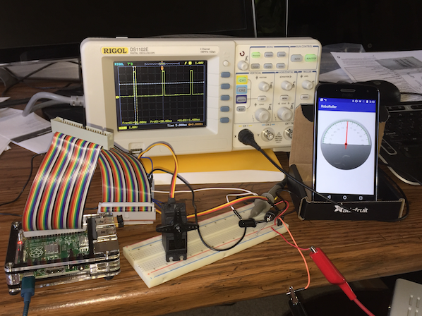
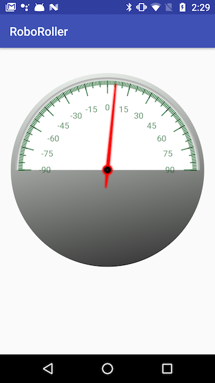

# RoboRoller Introduction 
RoboRoller is a toy Android and Raspberry Pi application. The roll angle of the Android device is obtained using the Android hardware SensorManager library. The roll angle of the Android is displayed using a custom view on the Android device. The angle is then sent to a Raspberry Pi which positions a servo to the same roll angle. If the Android device and servo are aligned so that the axes of roll rotation for both devices are parallel then the servo will rotate in concert with the Android device as the Android is rotated about its longitudinal roll axis.  

## Major System Components

### Android Device
The Android app was developed on a phone but could be modified to run on a tablet. The app is locked to the portrait orientation for convenience. There is nothing really noteworthy about the device.

### Android Software
The Android application is contained in the app folder of the project Repo. The app uses two external libraries, Jake Wharton's Timber library for logging and the RabbitMQ amqp-client for sending roll angle data to the RabbitMQ server.

The Android app subscribes for orientation updates provided by the android.hardware.SensorManager. [Keith Platfoot's](https://tinyurl.com/y9ayq2cn) excellent Android rotation sensor example provided the basis for obtaining the roll angle of the device. The yaw and pitch angle data is not used but could similarly be mapped to two additional servos for a more complete remote attitude positioning of the device.

A custom guage view was created for displaying the roll angle on the Android. The RollView gauge is packaged as an Android library and is derived from the beautiful [Gauge](https://tinyurl.com/yc9qf7ht) developed by Serge Helfrich. I found the Gauge project to be an outstanding example of creating an artful design!

  
  
  

The Android app applies some high pass filtering of the roll angle and only transmits angle changes of 1 degree or more to the RabbitMQ server. As noted in the Servo section, the servo frequency is 50 Hz which could easily be overrun by more granular angle updates.

Finally, as noted, the last functional aspect of the Android app is to send the filtered roll angle samples to the RabbitMQ server.

### Raspberry Pi
I used a Model B+ Raspebrry Pi, model year 2014, leftover from a previous project which I used to drive the servo. I used the [pi4j](http://pi4j.com/) Java library for writing the pi code. Any of the Raspberry models should be adequate for the solution that have a PWM output pin. 

### Raspberry Pi Software
(TODO)

### Servo
An inexpensive (cheap) servo was used to track the roll angle. Specifically, a [TowerPro SG-5010](https://tinyurl.com/ya6trczd) which is spec'd to have a 180&deg; range of motion. The actual or achieved range of motion will be discussed in the details below.

(TODO)

### RabbitMQ Server
The roll angle of the Android device is transmitted to the Raspberry Pi using a RabbitMQ message broker. I hosted the RabbitMQ server on an iMac so that the Android code and Raspeberry Pi code could be developed without requiring both platforms to be up and running all of the time. Initially, I also had some reservation about hosting the RabbitMQ server on the Pi but it appears from other project reviews on the web that the Pi is more than capable of hosting the RabbitMQ server. Something to investigate if interested.

